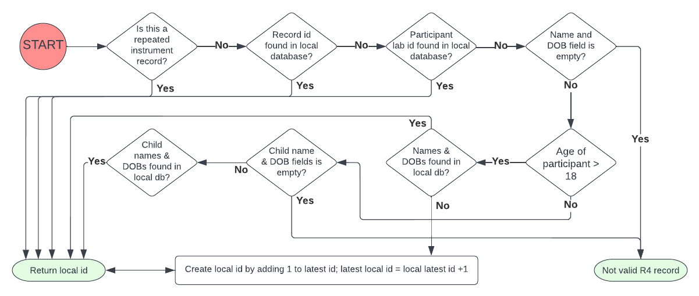

### Introduction
- The is an eMERGE 4 support program
- Set up a merged R4 and local redcap database
- Pull R4 data periodically to populate the local redcap database
- Send out auto reminder for users to complete the survey in R4.

### To be done
- Since R4 is constantly changing, a better machanism is needed to report and monitor the change. Especially to avoid the errors like `ERROR:root:b'{"error":"The following fields were not found in the project as real data fields: your_or_your_childs_3"}'`
- The file sync is not supported currently. 
- Pull updated record only.

### How to use 
1. Create API token and endpoint
    - Create a file named `api_tokens.json` and put it under the root dir of this repo. An example of this json file is showed below.
    ```json
    {
        "api_key_local": "XXXXXXXXXXXXXXXXXXXXXXXXXXXXXXXX",
        "api_key_r4": "XXXXXXXXXXXXXXXXXXXXXXXXXXXXXXXX",
        "local_endpoint": "https://emerge4.dbmi.columbia.edu/redcap/api/",
        "r4_api_endpoint" : "https://redcap.vanderbilt.edu/api/"
    } 
    ```

2. Try `get_redcap_version.py` to make sure the connection and API token works
    ```sh
    # Since columbia use CAS to authenticate local Redcap, we have to 
    # add a list of IP (where this program hosted) into the whitelist
    # aqua is a dynamic IP, has to add them all
    # check IP by viewing apache logs.
    sudo tail -100 /var/log/apache2/access.log | grep /redcap/api/
    sudo vi /etc/apache2/sites-available/redcap-cas.conf
    ```
    ```xml
        #### Open up the API without auth
        <DirectoryMatch "^/var/www/html/redcap/api/">
            # Exempted IPs. Can also use CIDR notation.
            Require ip 127.0.0.1 172.xx.xx.xx 172.xx.xx.xx
        </DirectoryMatch>
    ```
3. Make a copy of local custermized redcap build
    * make sure the field name has been adjusted. (avoid conflict when merging with R4)
    * obtain new API tokens and change `api_tokens.json` accordingly.

4. Use `project_setup.py` to dump the dictionary from both R4 and local redcap projects, and then load into the local redcap project created in **3**.
    * fixed the conflicts by renaming fields and instrument.
    * enable on repeated instument (GIRA, Mono, BROAD)
5. Modify `data_pull_from_r4.py` to pull R4 data periodically into local Redcap
    - `cumc_id` will be created by adding 1 into the current largest number in local redcap. Numbers larger than `10000` are reserved for those Epic imported records.
    - Pull R4 data and match local data by 
        1. record_id in r4; (This can be assigned a record_id in a local record to enable a forced manual match.) 
        2. participant IDs; 
        3. first_name, last_name & DOB.
        4. If can not find a match in local data, create a new CUIMC_ID incremented. 
    
    - Also pull R4 surveyQueueLink via API for each record and store in [r4_survey_queue_link]
    - set up crob job for daily pull `cron_job.sh`. An example is showed below.
        ```sh
        # m h  dom mon dow   command
        0 0 * * * sh /phi_home/cl3720/phi/eMERGE/eIV-recruitement-support-redcap/cron_job.sh
        ```
5. Set up alert machanism to send out auto reminder.
    - See [create_survey_alert.md](./create_survey_alert.md) for more details
    - if [previous_survey_complete] = '2' AND [reminder_survey_complete] !='2'
    - send out [r4_survey_queue_link]
    - data fetch will only trigger the alert once.
    - In addition, if you want to send out email via a valid SMTP server, please see [redcap_send_out_email.md](./redcap_send_out_email.md) for more details.

