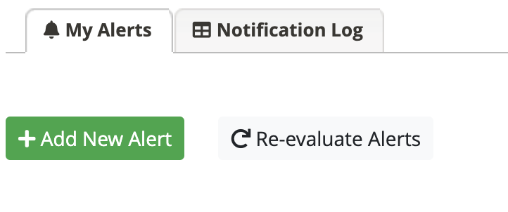
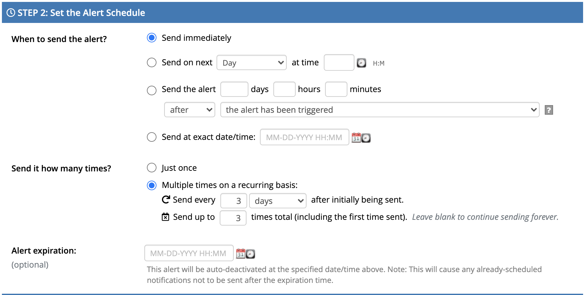

# This is a brief tutorial on how to create alert in local redcap to send automated emails with R4 link to participant.

- Since the local redcap will not act as a survey but rather like a data repo, we will not use the survey notification feature provided by RedCap. 
- We will use **alert** feature in RedCap to achieve this goal.

## An example
- Goal: send automated email reminder to participant and ask them to complete part_2 consent in R4.

### 1. Store R4 survey queue Link in the local redcap project. 
- we name the variable as `r4_survey_queue_link`. 
- This is a participant-specific URL 

### 2. Go to "Alert & Notifications" and "Add New Alert"
- The *re-evaluate* button is not for testing purpose.
- To test, make sure all previous alert send events are cleared by executing SQL query [refresh_alert.sql](./refresh_alert.sql) on the backend.
- You can also upload alerts. For example we used can be found [here]()

### 3. Define the logic to trigger the alert. 
- **Note**: Since the records in the local redcap is entered by API data pull, the third radio should be selected for *A) How will this alert be triggered?*

### 4. Define the alert schedule
- **Note**: The alert will only be triggerred once per individual according to the previous setting - meaning the data pull/overwrite won't re-trigger this alert. 
- According to the setting below, the alert will be triggered **once** but scheduled to send out email **3 times** in total.

### 5. Send out message 
- Make sure the R4 url (e.g. [`r4_survey_queue_link`]) is included in the message using the smart variable provided by RedCap
